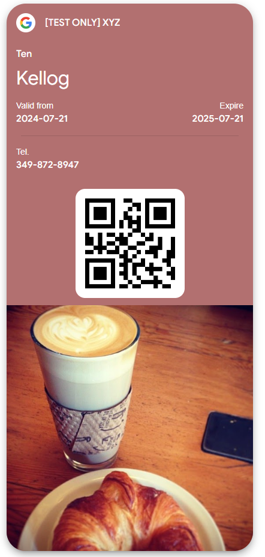

# Blazor: Getting Started with Google Wallet API

This project demonstrates how to integrate the Google Wallet API into a Blazor application. It allows users to create, manage, and issue generic passes using the Google Wallet API. Below is a guide to help you set up and understand the project.

---

## **Getting Started**

### **1. Setting Up Your Google Wallet Account**
- **Onboarding Guide**: Follow the [Google Wallet Onboarding Guide](https://developers.google.com/wallet/generic/getting-started/onboarding-guide) to set up your account.
- **Enable Wallet API**: Enable the Google Wallet API for your account and generate your private key. Create an email account to authenticate all API requests. Refer to the [Issuer Onboarding Guide](https://developers.google.com/wallet/generic/getting-started/issuer-onboarding) for detailed steps.
- **Authentication**: Learn how to authenticate REST API requests using the [Authentication Guide](https://developers.google.com/wallet/generic/getting-started/auth/rest).

---

### **2. Building Your First Pass**
- **Pass Builder**: Use the [Generic Pass Builder](https://developers.google.com/wallet/generic/resources/pass-builder) or [Event Ticket Pass Builder](https://developers.google.com/wallet/tickets/events/resources/pass-builder) to design your pass. The JSON generated from the builder can be translated into code.
- **Pass Structure**: Understand the basics of pass classes and objects:
  - **Class**: Acts as a template (e.g., event name, location).
  - **Object**: Represents a unique pass for each individual (e.g., name, unique identifier).
  - Learn more about [how classes and objects work](https://developers.google.com/wallet/generic/overview/how-classes-objects-work).
- **Workflow**: Review the [workflow for issuing a pass](https://developers.google.com/wallet/generic/overview/add-to-google-wallet-flow) and the [web integration guide](https://developers.google.com/wallet/generic/web).

---

### **3. Publishing Your Pass**
- **Testing**: Passes are not public by default and can only be used for testing.
- **Publishing**: To publish your pass, follow the [Request Publishing Access Guide](https://developers.google.com/wallet/generic/test-and-go-live/request-publishing-access).

---

## **Sample Code**
- **Dotnet Samples**: Explore sample code for each type of pass in the [Google Wallet REST Samples Repository](https://github.com/google-wallet/rest-samples/tree/main/dotnet).

---

## **In This Repository**
The Google Wallet Form in this project takes the following inputs:
- Name
- Phone Number
- Unique Employee ID
- Color

These inputs are used to create a `GenericPassObject`. The `GenericCard` class acts as a manager and includes methods for authentication, creation, modification, JWT token signing, and deletion. It takes a generic class and object as inputs.

### **Before Running the Code**
1. Include your private key in the `Model` folder.
2. Replace the placeholder code in `Model/GenericCard.cs` (line 39) with your private key.

### **Known Issues**
- The QR code currently does not work due to the long link generated by each pass. A link-shortening step is required before converting it into an image.

---

## **Example Pass Link**
Here’s an example of a pass link:  
[https://pay.google.com/gp/v/valuable/df74ed95627849bca797ee5f857ca756?vs=gp_lp](https://pay.google.com/gp/v/valuable/df74ed95627849bca797ee5f857ca756?vs=gp_lp)

---

## **Screenshot**

---

## **Next Steps**
- Refactor the code to shorten the pass link and enable QR code functionality.
- Explore additional pass types and customization options provided by the Google Wallet API.

---

Feel free to contribute or report issues!
